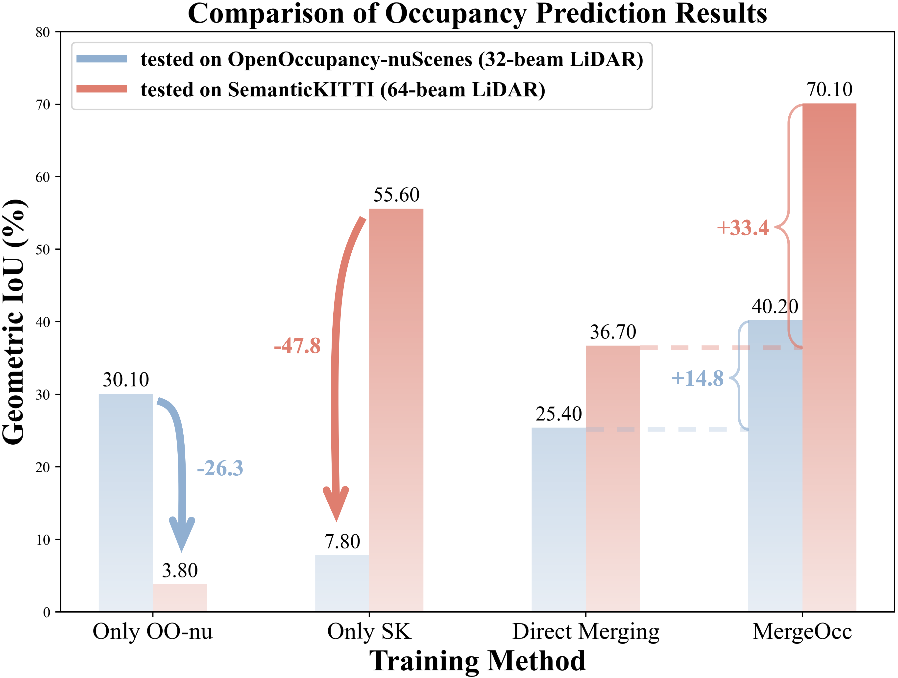

# MergeOcc: Bridge the domain gap between different LiDARs for robust occupancy prediction

# Abstract

LiDAR-based 3D occupancy prediction algorithms have evolved rapidly alongside the emergence of large datasets. Nevertheless, considerable performance degradation often ensues when models trained on a specific dataset are applied to real-world scenarios with disparate LiDAR.  
This research aims to develop a generalized model capable of handling different LiDARs simultaneously, bridging the domain gap to facilitate seamless deployment across heterogeneous platforms. We observe that the gaps among LiDAR datasets primarily manifest in geometric disparities (such as variations in beams and point counts) and semantic inconsistencies (scenario diversity and taxonomy conflicts). 
To this end, this paper proposes MergeOcc, an occupancy prediction pipeline that employs geometric realignment and semantic label mapping to facilitate multiple datasets training (MDT) and mitigate cross-LiDAR issues. 
The efficacy of MergeOcc is validated through comprehensive experiments on two prominent datasets: OpenOccupancy-nuScenes and SemanticKITTI.
MergeOcc demonstrates extra robustness and outstanding performance simultaneously across both types of LiDARs, outperforming several SOTA multi-modality methods.
Furthermore, while using identical model architecture and hyper-parameters, MergeOcc significantly surpasses the baseline owing to exposure to larger and more diverse data, which is unprecedented in the realm of 3D perception.
We anticipate increased attention to the MDT paradigm.

# Getting Started

- [Installation](docs/install.md) 

- [Prepare Dataset](docs/prepare_data.md)

- [Training, Evaluation, Visualization](docs/trainval.md)

# **overview  framework**

# Primary Results

#  Acknowledgement

Many thanks to these excellent projects:
- [OpenOcuupancy](https://github.com/JeffWang987/OpenOccupancy)
- [SurroundOcc](https://github.com/weiyithu/SurroundOcc)
- [MonoScene](https://github.com/astra-vision/MonoScene)
- [Unidet](https://github.com/xingyizhou/UniDet)
