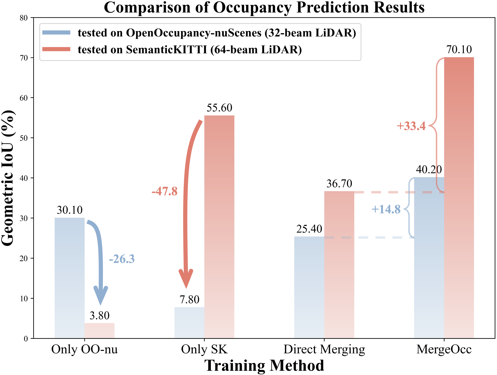

# MergeOcc: Bridge the domain gap between different LiDARs for robust occupancy prediction

# Abstract

LiDAR-based 3D occupancy prediction algorithms evolved rapidly with the advent of large-scale datasets.  
However, the full potential of the existing diverse datasets remains underutilized, as they are typically employed in isolation. 
Models trained on a single dataset often suffer considerable performance degradation when deployed to real-world scenarios or datasets involving disparate LiDARs.
To address this limitation, we introduce MergeOcc, a generalized pipeline designed to handle different LiDARs by leveraging multiple datasets concurrently.
The gaps among LiDAR datasets primarily manifest in geometric disparities and semantic inconsistencies, which correspond to the fundamental components of datasets: data and labels. In response, MergeOcc incorporates a novel model architecture that features a geometric realignment and a semantic label mapping to facilitate multiple datasets training (MDT). 
The effectiveness of MergeOcc is validated through extensive experiments on two prominent datasets for autonomous vehicles: OpenOccupancy-nuScenes and SemanticKITTI.
The results demonstrate its enhanced robustness and performance improvements across both types of LiDARs, outperforming several SOTA methods. 
Additionally, despite using an identical model architecture and hyper-parameter set, MergeOcc can significantly surpass the baselines thanks to its ability to learn from diverse datasets. 
To the best of our knowledge, this work presents the first cross-dataset 3D occupancy prediction pipeline that effectively bridges the domain gap for seamless deployment across heterogeneous platforms.

# Getting Started

- [Installation](docs/install.md) 

- [Prepare Dataset](docs/prepare_data.md)

- [Training, Evaluation, Visualization](docs/trainval.md)

# **overview  framework**

# Primary Results

#  Acknowledgement

Many thanks to these excellent projects:
- [OpenOcuupancy](https://github.com/JeffWang987/OpenOccupancy)
- [SurroundOcc](https://github.com/weiyithu/SurroundOcc)
- [MonoScene](https://github.com/astra-vision/MonoScene)
- [Unidet](https://github.com/xingyizhou/UniDet)
